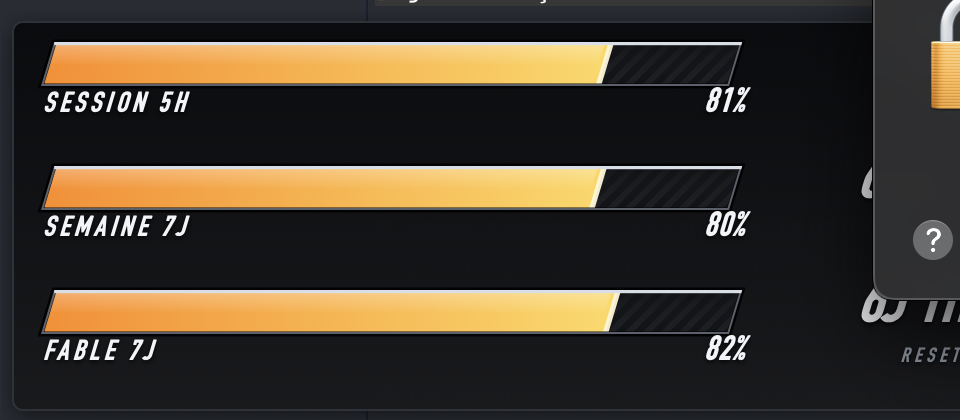

# ClaudeHP

Barre de vie Tekken pour ton quota Claude, posée sur le bureau.



## Ce que ça montre

Les mêmes chiffres que `/usage`, lus sur `GET /api/oauth/usage` :

| Barre | Source |
|---|---|
| `SESSION 5H` | `limits[kind=session]` |
| `SEMAINE 7J` | `limits[kind=weekly_all]` |
| `FABLE 7J` | `limits[kind=weekly_scoped]`, nommée d'après `scope.model.display_name` |

La barre affiche ce qu'il **reste**, pas ce qui est consommé : `/usage` dit « 18 % used »,
la barre est à 82 %. Sous 20 % elle vire au rouge et pulse.

Toute nouvelle fenêtre `weekly_scoped` apparaît toute seule — rien à recoder si un
autre modèle reçoit sa propre limite.

## Usage

- **Clic** : replie / déplie (compact = session seule, déplié = toutes les fenêtres)
- **Glisser** : déplacer, la position est retenue
- **Clic droit** : lancer au démarrage, quitter

## Build

```sh
./build.sh && open ClaudeHP.app
```

## Trousseau

L'app lit le jeton OAuth de Claude Code dans le trousseau (`Claude Code-credentials`)
pour signer l'appel API. Le jeton n'est ni journalisé ni écrit sur disque.

macOS demande l'autorisation au premier lancement : clique **Toujours autoriser**.
L'autorisation est liée à la signature du binaire — **chaque `./build.sh` la réinitialise**
et le dialogue revient une fois.

Si le jeton expire sans qu'aucune session Claude Code ne le rafraîchisse, l'appel échoue
et les barres passent en `EN ATTENTE` plutôt que d'afficher un chiffre périmé.
